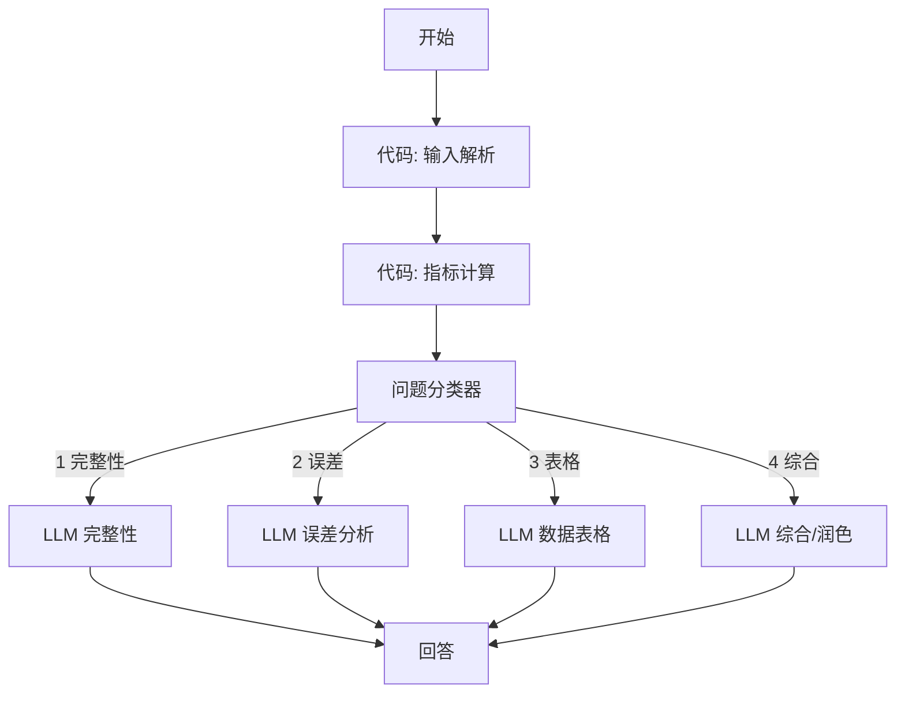
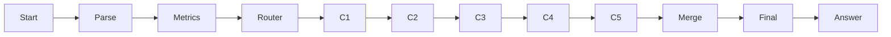

# 物小智 · 学生实验报告写作助手（Dify 工作流）

本文说明如何在 Dify 中配置 `report-assist`（学生端报告页「小智辅助」），实现：

- 检查报告还缺什么
- 根据本次实验记录整理误差分析
- 把测量数据整理成 Markdown/HTML 表格

---

## 1. 与物小智后端的对接

### 1.1 配置 Key

在 `config/dify.env` 中填写（导入工作流后从 Dify 应用 API 页复制）：

```env
DIFY_WF_REPORT_ASSIST=app-xxxxxxxxxxxxxxxx
```

重启后端。未配置时会回退到 `DIFY_WF_TEXT_ASSIST`（通用问答，**无法**读会话数据）。

### 1.2 后端自动注入的变量

学生端 `AskPanel` 调用 `POST /api/ai/conversations/{id}/chat/stream` 时，后端会为 `report-assist` 注入：

| 变量 | 来源 | 用途 |
|------|------|------|
| `query` | 学生输入 | 用户问题 |
| `experiment_code` | 当前实验 | 路由/提示词 |
| `experiment_name` | manifest | 提示词 |
| `experiment_knowledge` | report-guide Knowledge | 原理要点 |
| `sessionId` → 展开 | 当前 session | 拉取实验记录 |
| `data_logs_json` | 各步骤提交的数据 | 表格、误差分析 |
| `corrections_json` | 视觉/操作纠错 | 误差来源 |
| `report_knowledge` | 报告指引 Knowledge | 完整性检查 |
| `report_path` | 报告指引 Follow-up | 讨论/误差提纲 |
| `purpose` … `discussion` | 学生草稿各章 | 对照缺项 |
| `filled_section_keys` | 已填章节 key 列表 | 完整性 |
| `section_word_counts` | 各章字数 | 质量启发式 |
| `chat_history` | 本对话最近几轮 | 多轮上下文 |

**前提**：学生在报告页必须有有效 `sessionId`（完成或进行中的实验会话）。

---

## 2. 推荐工作流结构（Chatflow）

### 2.0 单链 vs 多分支（先读这个）

仓库里有两个 DSL，**不要混用**：

| 文件 | 拓扑 | 每次请求跑几个 LLM | 适用场景 |
|------|------|-------------------|----------|
| `wuxiaozhi-report-analysis-rich.yml` | **单链串联** | **全部**（完整性→数据→误差→润色→复盘→总控） | 要「一次给全面体检报告」 |
| `wuxiaozhi-report-assist-branched.yml` | **多分支** | **只跑 1 条** | 侧边栏快捷提问（推荐） |

`rich.yml` 里的 `router` 节点**只做打标签**，并没有真正分叉——所有 LLM 仍会依次执行，所以看起来像「一条分支」，且 **Token 消耗大、延迟高**。

**学生端侧边栏**建议用 **多分支版**：问「缺什么」只走完整性支路，问「整理表格」只走表格支路。

生成/更新 DSL：

```bash
python scripts/build_report_analysis_dify.py
```

会同时输出 `wuxiaozhi-report-assist-branched.yml`。

---

### 2.1 多分支拓扑（推荐）



**Dify 画布操作（手动搭）：**

1. 添加 **代码** 节点 `parse`、`metrics`（见 §2.3、§2.4）
2. 添加 **问题分类器** 节点，定义 4 个 class（与侧边栏三条建议 + 综合对齐）
3. 从分类器 **4 个出口** 分别连到 **4 个 LLM** 节点（各用 §2.5 对应提示词）
4. 4 个 LLM **都连到同一个「回答」节点**，回答内容为：
   ```
   {{#llm_check.text#}}{{#llm_error.text#}}{{#llm_table.text#}}{{#llm_general.text#}}
   ```
   （每次只有一条支路有输出，其余为空）
5. 发布 → 复制 Key → `DIFY_WF_REPORT_ASSIST=...`

**可选：IF/ELSE 代替分类器**

若不想用 LLM 做意图识别，可在 `metrics` 后加 **代码 router**（关键词，见 §2.4），再接 **IF/ELSE** 节点，按 `route == completeness` 等条件分叉。适合意图固定、要零分类成本的场景。

---

### 2.2 单链拓扑（rich 版，全面但慢）



所有 LLM 串行执行，最后由 **总控 LLM** 合并输出。适合「一键全面审阅」，不适合高频侧边栏问答。

---

### 2.3 开始节点 — 输入变量

在 Dify Chatflow「开始」节点声明（与后端注入对齐）：

| 变量名 | 类型 | 必填 |
|--------|------|------|
| `query` | 文本 | 是（系统用户消息） |
| `experiment_code` | 文本 | 否 |
| `experiment_name` | 文本 | 否 |
| `experiment_knowledge` | 段落 | 否 |
| `data_logs_json` | 段落 | 否 |
| `corrections_json` | 段落 | 否 |
| `report_knowledge` | 段落 | 否 |
| `report_path` | 段落 | 否 |
| `purpose` | 段落 | 否 |
| `principle` | 段落 | 否 |
| `apparatus` | 段落 | 否 |
| `procedure` | 段落 | 否 |
| `data` | 段落 | 否 |
| `results` | 段落 | 否 |
| `discussion` | 段落 | 否 |
| `filled_section_keys` | 文本 | 否 |
| `chat_history` | 段落 | 否 |

### 2.4 代码节点 `parse` — 解析与本地指标

```python
import json

def main(query: str, experiment_code: str, experiment_name: str,
         data_logs_json: str, filled_section_keys: str,
         purpose: str, principle: str, apparatus: str, procedure: str,
         data: str, results: str, discussion: str, **kwargs) -> dict:
    required = [
        ("purpose", "实验目的", purpose),
        ("principle", "实验原理", principle),
        ("apparatus", "实验仪器", apparatus),
        ("procedure", "实验步骤", procedure),
        ("data", "数据与处理", data),
        ("results", "实验结果", results),
        ("discussion", "分析与讨论", discussion),
    ]
    missing = [label for key, label, text in required if not (text or "").strip()]
    try:
        logs = json.loads(data_logs_json or "[]")
    except Exception:
        logs = []
    has_data = len(logs) > 0
    return {
        "missing_sections": "、".join(missing) if missing else "无",
        "missing_count": len(missing),
        "has_session_data": "是" if has_data else "否",
        "data_log_count": len(logs),
        "experiment_label": experiment_name or experiment_code or "本次实验",
    }
```

### 2.5 代码节点 `router` — 意图识别（IF/ELSE 方案用）

```python
def main(query: str, missing_count: int, has_session_data: str, **kwargs) -> dict:
    q = (query or "").lower()
    if any(k in q for k in ["缺", "完整", "还少", "检查", "遗漏"]):
        route = "completeness"
    elif any(k in q for k in ["误差", "不确定", "偏差", "讨论"]):
        route = "error_analysis"
    elif any(k in q for k in ["表格", "数据表", "整理数据", "测量数据"]):
        route = "data_table"
    elif any(k in q for k in ["润色", "改写", "优化", "表述"]):
        route = "polish"
    else:
        route = "general"
    return {"route": route}
```

用 **条件分支** 或 **IF 节点** 按 `route` 连接不同 LLM。

### 2.6 LLM 节点提示词模板

#### A. 完整性检查 (`completeness`)

```
你是大学物理实验报告写作助手，实验：{{#experiment_label#}}。

## 报告规范要点
{{#report_knowledge#}}

## 学生已填章节
{{#filled_section_keys#}}

## 本地检查结果
缺失章节：{{#missing_sections#}}（共 {{#missing_count#}} 项）
是否有实验台提交数据：{{#has_session_data#}}

## 学生各章草稿摘要
- 目的：{{#purpose#}}
- 原理：{{#principle#}}
- 数据：{{#data#}}
- 结果：{{#results#}}
- 讨论：{{#discussion#}}

## 学生问题
{{#query#}}

请用中文、分点回答：
1. 还缺哪些必备内容（对照七段结构）
2. 每处缺项给出 1 句可执行的补充建议
3. 若「数据与处理」为空但有实验台数据，提醒点击「从实验记录填充」
不要编造学生没做的测量数据。
```

#### B. 误差分析 (`error_analysis`)

```
实验：{{#experiment_label#}}

## 实验记录（JSON）
{{#data_logs_json#}}

## 操作纠错
{{#corrections_json#}}

## 报告讨论提纲（来自实验指引）
{{#report_path#}}

## 学生当前讨论草稿
{{#discussion#}}

## 问题
{{#query#}}

请根据**真实实验记录**整理误差分析思路：
1. 列出 3–5 个主要误差来源（仪器、操作、环境、读数方法）
2. 每个来源说明对结果的影响方向（偏大/偏小/不确定）
3. 给出可在报告中写进「分析与讨论」的段落提纲（不要代写全文）
4. 若纠错记录中有具体失误，必须引用
禁止虚构数据。
```

#### C. 数据表格 (`data_table`)

```
实验：{{#experiment_label#}}

## 实验记录
{{#data_logs_json#}}

## 学生问题
{{#query#}}

请把测量数据整理成 **Markdown 表格**（可直接粘贴进报告）：
1. 按实验步骤分组，每组一个表
2. 表头用中文物理量名与单位
3. 若 JSON 中缺字段，用「—」占位并说明
4. 表格后附 1–2 句「还可补充的计算/不确定度列」建议

牛顿环示例列：m, n, 左读数/mm, 右读数/mm, D/mm
空气劈尖示例：x₁, x₂, L′, n′, L
显微镜示例：样品, A/mm, A′/mm, L/mm
```

#### D. 段落润色 (`polish`) / 综合 (`general`)

按需缩短；综合节点可合并 completeness + 学生具体问题。

---

## 3. 导入现成 DSL

| 文件 | 说明 |
|------|------|
| **`docs/dify/wuxiaozhi-report-assist-branched.yml`** | **多分支（推荐）** — 问题分类器 → 4 条互斥 LLM |
| `docs/dify/wuxiaozhi-report-analysis-rich.yml` | 单链丰富版 — 全部 LLM 串行 + 总控合并 |

导入步骤：

1. Dify → 创建应用 → **导入 DSL** → 选 `wuxiaozhi-report-assist-branched.yml`
2. 检查「开始」节点变量是否与 §2.3 一致
3. 发布 → API → 复制 App Key → 写入 `config/dify.env`：
   ```env
   DIFY_WF_REPORT_ASSIST=app-xxxxxxxx
   ```
4. 重启物小智后端

生成/更新 YAML：`python scripts/build_report_analysis_dify.py`

**知识库 + 按实验过滤检索**：见 [SETUP-REPORT-ASSIST-KB.md](./SETUP-REPORT-ASSIST-KB.md)（立项 Word → Excel 导入 teaching 库）。

---

## 4. 三实验差异化（manifest 已配置）

| 实验 code | 数据步骤 | 报告指引文件 |
|-----------|----------|--------------|
| `newton_rings` | 3 测环径、4 算 R | `experiments/newton_rings/report-guide.md` |
| `air_wedge_thickness` | 3 测条纹、4 算厚度 | `experiments/air_wedge_thickness/report-guide.md` |
| `microscope_length_measurement` | 3 测长度、4 统计 | `experiments/microscope_length_measurement/report-guide.md` |

前端「从实验记录填充」会按实验 code 生成 **HTML 数据表**；Dify 侧读 `data_logs_json` 即可，无需按实验拆工作流。

---

## 5. 验证清单

1. 学生完成实验并提交至少一步数据
2. 打开 `/after/{code}/report`，点击「从实验记录填充」→ 第 5 节出现表格
3. 预览 / 导出 Word → 表格与正文一致
4. 小智辅助问「检查报告还缺什么」→ 能指出未填章节
5. 问「整理误差分析」→ 引用 corrections / data_logs，不编造数字
6. 问「整理成表格」→ 返回 Markdown 表

---

## 6. 常见问题

**Q：助手不知道我的数据？**  
A：确认 `DIFY_WF_REPORT_ASSIST` 已配置且非 text-assist 回退；报告页需有 `sessionId`；后端日志可看 `data_logs_json` 是否为空。

**Q：预览有公式，Word 里是纯文字？**  
A：当前 Word 导出保留公式 LaTeX 文本；完整 OMath 可后续迭代。

**Q：与教师端 `report-review` 区别？**  
A：`report-assist` 面向**学生写作**；`report-review` 面向**教师评阅**（可共用类似提示词，但权限与入口不同）。
