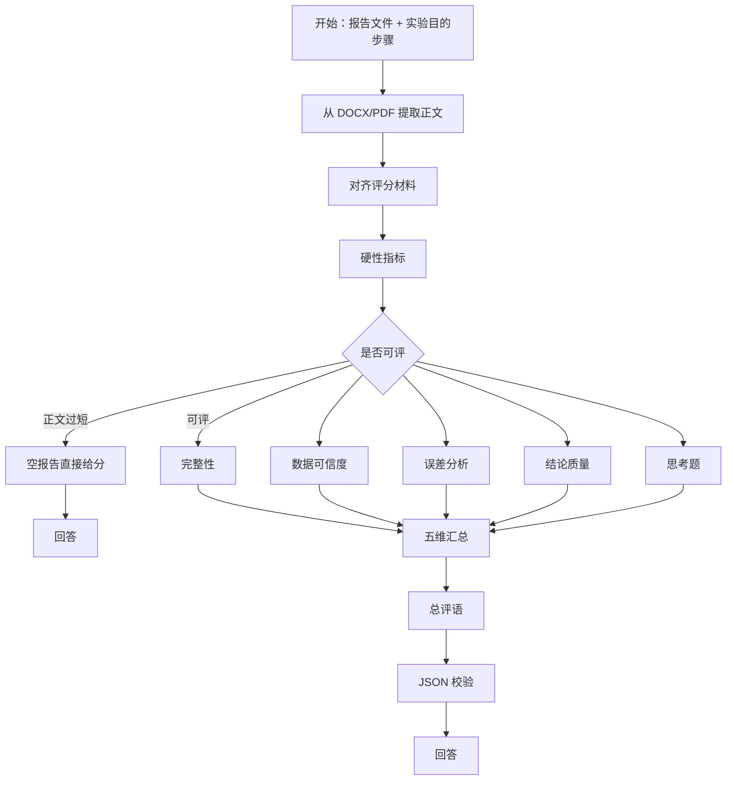

# 物小智 · 教师报告预评（Dify 工作流）

对应 DSL：`docs/dify/物小智-教师报告预评.yml`（由 `scripts/build_report_review_dify.py` 生成）

这是**教师端**「报告分析 → AI 预评」专用 Chatflow，不要和学生端「报告助手」混用。

## 1. 生成最新 DSL

修改提示词或节点后执行：

```bash
python scripts/build_report_review_dify.py
```

会同时写出：

- `docs/dify/物小智-教师报告预评.yml`
- `docs/dify/wuxiaozhi-report-review.yml`（内容相同）

## 2. 导入 Dify 并发布

1. 打开 Dify **工作室** → **导入 DSL**
2. 选择 `docs/dify/物小智-教师报告预评.yml`
3. 若已有旧版，建议**新建应用**导入，避免节点 ID 冲突；已经导入过「一条线」旧版的，请重新导入本文件覆盖。
4. 确认模型为已配置的通义 `qwen-plus`（与现有报告助手相同）
5. **发布** → 访问 API → 复制 API Key（`app-...`）

## 3. 写入后端配置

编辑 `config/dify.env`：

```env
DIFY_WF_REPORT_REVIEW=app-你的预评Key
```

**不要**把学生端 `DIFY_WF_REPORT_ASSIST` 填到这里。未配置时，教师端预评会提示工作流未接入，而不会再悄悄走学生报告助手。

重启后端：`scripts/run-backend.bat`

## 4. 工作流节点（有分叉，不是一条线）



| 节点 | 作用 |
|------|------|
| 开始 | 两个主输入：学生报告**文件**、本实验**目的与步骤** |
| 文档提取 | 把 DOCX/PDF 转成正文，供后续评分 |
| 硬性指标 | 字数、章节痕迹、风险；输出 `review_route` |
| 是否可评 | **IF/ELSE**：正文过短走 A，否则走 B |
| 分支 A | 不跑大模型，直接低分 + 退回说明 |
| 分支 B1–B5 | **五维并行**打分 |
| 汇总 / 总评 | 加总 10 分制建议分，再写教师评语 |

## 5. 后端注入的变量

| Dify 变量 | 来源 |
|-----------|------|
| `student_report_file` | 学生报告 Word 文件（上传到 Dify） |
| `experiment_spec` | 本实验目的、原理要点、步骤、应测字段 |
| `experiment_name` | 实验名称 |
| `student_name` / `student_class` | 学生 |

输出 JSON 示例：

```json
{
  "score": 7.6,
  "score100": 76,
  "maxScore": 10,
  "gradeBand": "中等",
  "comment": "……",
  "dimensions": [],
  "risks": [],
  "needsTeacherConfirm": true
}
```

`score` 为 **10 分制建议分**。教师可在页面上改分、改评语，点「完成批改」后才落档。

## 6. Dify 预览调试

在工作室预览里，`query` 填「请对本份实验报告做预评」，并粘贴一段 `student_report` 与 `experiment_guide`。应返回纯 JSON（不要 Markdown 代码块）。

预评主路径含 5 个并行 LLM + 1 次总评，大约 20–50 秒，属正常。空报告会走短路，几乎立刻返回。

## 常见问题

| 现象 | 处理 |
|------|------|
| 页面提示工作流未接入 | `DIFY_WF_REPORT_REVIEW` 为空或仍是学生助手 Key |
| 有评语没分数 | 看 Answer 节点是否为 `{{#format.result_json#}}`；重新导入 DSL |
| 导入后模型报错 | 把各 LLM 节点模型改成你工作室里已启用的通义模型 |
| 请求超时 | 前端已放宽到 180 秒；若仍超时，在 Dify 看哪一维 LLM 卡住 |
