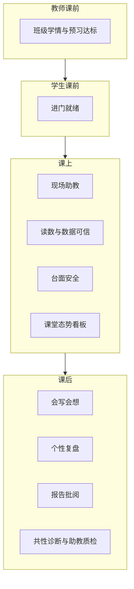

# 实验课 AI 能力规划（教学场景版）

## 设计立场

不从「仓库里已有哪些工具」出发，而从一堂大学物理实验课里**师生真正卡住的地方**出发。

目标用户：
- **学生**：第一次做某个实验时，怕做错、读不准、数据怪、报告空、做完没收获
- **教师**：人数多、看不过来、批改累、不知道班里共性卡点、难判断 AI 是否帮倒忙

原则：
1. 每个能力对应一个明确教学目标，而不是「多一个聊天入口」
2. AI 可以教、查、诊断、出建议；**不能替学生完成必须亲手完成的学习**（代写答案、代填不可核验数据）
3. 精确计算、评分底线用规则/本地算法；模型负责解释、诊断、生成教学语言
4. 学生能力产生过程数据，教师能力消费这些数据——两边要成对设计

---

## 一堂实验课的 AI 地图



---

## 学生侧：6 个核心能力

### S1. 进门就绪（课前）

**教学目标**：进实验室前具备最低必要概念，而不是到了现场才翻讲义。

**能力设计**：
- 给出「本实验 5 分钟就绪包」：要测什么、关键公式 1–2 个、今天最容易错的 3 件事、必查器材
- 附带短自测（3–5 题），只考进门必须会的判断（如牛顿环：接触点、环序、读数方向）
- 输出「就绪 / 未就绪」状态，供教师看板使用

**不做**：长篇预习报告代写（易抄袭、教学价值低）。

---

### S2. 现场助教（课上主能力，已有指导纠错的升级定位）

**教学目标**：操作卡住时，像助教一样「看一眼、指一步」，而不是讲一堂课。

**能力设计**：
- 文字问：当前步骤该做什么、为什么这样、下一步是什么
- 拍照问：装置/光路/对线是否正确，指出偏差与纠正动作
- 回答约束：优先给「可执行的下一步」；必要时追问一张图或一个读数，而不是空泛理论

**升级点（相对现状）**：
- 与当前步骤强绑定（知道学生在第几步）
- 同一错误反复出现时，降级为更短提示 + 「请先完成 X 再问」
- 把纠错事件记入学生过程档案，供复盘与教师诊断

---

### S3. 可信数据（课上后半段 → 课后初）

**教学目标**：保证进入报告的数据「物理上说得通」，并让学生理解读数过程。

**拆成两个紧密动作**：
1. **读数辅导**：拍仪器（显微镜、卡尺、螺旋测微器等）→ 讲解如何读 → 给出建议读数（学生确认后才入库）
2. **数据体检**：对一组测量值做量级、离群、单位、有效数字、与理论预期的粗检；结论分三级：可继续 / 建议复测 / 必须排查

**关键边界**：AI 不得静默改学生原始数据；所有写入需确认。计算（逐差、拟合、不确定度）走确定性算法，AI 只解释含义与异常。

---

### S4. 会写会想（课后文书）

**教学目标**：学会按实验报告规范表达，并独立思考思考题。

**能力设计**：
- **报告教练**：基于本实验真实数据与过程记录，帮助补全结构（目的/原理/步骤/数据/误差/结论）、润色表述、检查缺项
- **思考题教练**：只给思路支架、相关公式、常见误区；不给可直接粘贴的完整答案

**红线**：禁止「无数据空套模板」；思考题绝不代写终稿。

---

### S5. 个性复盘（课后收束）

**教学目标**：做完实验后知道「我到底卡在哪、下次怎么改」。

**能力设计**：基于该生本次全过程（求助点、纠错图、体检结果、耗时步骤）生成：
- 3 条个人薄弱点
- 1 条最可能的误差来源假设（需说明依据）
- 1 条下次实验行动建议

这是相对通用大模型的差异化能力：**有过程证据，不只是聊天总结**。

---

### S6. 台面安全与环境（课上常驻，轻量）

**教学目标**：降低明显的装置/环境风险，不抢主流程。

**能力设计**：摄像头抽帧巡检，输出等级化提示（正常 / 注意 / 危险），只在异常时打断。  
与 S2 分工：安全看「能不能做」，助教看「怎么做对」。

---

## 教师侧：4 个核心能力

### T1. 课前学情（对应 S1）

**教学目标**：上课前知道谁没准备好、班里卡在哪些概念。

**能力设计**：
- 预习达标率、未就绪名单
- 自测高频错题 Top N（按知识点聚合）
- 一键提醒未就绪学生（文案可由 AI 生成）

---

### T2. 课堂态势（对应 S2/S3/S6）

**教学目标**：人多时知道该先去哪一组。

**能力设计**（课堂仪表盘，不是又一个聊天窗）：
- 各组当前步骤、停留过久告警
- 近期高频纠错类型（如「牛顿环对线」「读数估读」）
- 数据体检「必须排查」人数
- 安全巡检异常列表

教师看到的是**态势与优先介入名单**，而不是替教师逐条回答学生。

---

### T3. 报告批阅（对应 S4）

**教学目标**：降低批改负担，同时保证评分尺度相对一致。

**能力设计**：
- 按实验评分要点自动预评：完整性、数据可信度、误差分析、结论、思考题质量
- 输出：建议分档/分数区间 + 可编辑批注 + 「疑似空套模板/数据异常」风险标记
- 教师确认后才成为正式成绩意见；AI 从不直接终裁

---

### T4. 共性诊断与助教质检（对应 S2/S5 与反馈）

**教学目标**：把一学期课上的过程数据，变成可改进教学与 AI 的洞察。

**能力设计**：
1. **班级共性诊断**：本实验 Top 卡点、典型错误样例、建议下次课前强调的 3 句话
2. **助教质检**：聚合学生对 AI 回复的「有帮助/无帮助」，找出低质量回答模式，给教师可转发的提示词/知识补丁建议

---

## 能力优先级（按教学杠杆）

| 优先级 | 能力 | 角色 | 为什么先做 |
|--------|------|------|------------|
| P0 | S2 现场助教（强化） | 学生 | 已有底座，课上刚需 |
| P0 | S3 可信数据 | 学生 | 直接决定实验成败与报告质量 |
| P0 | S4 报告教练 | 学生 | 课后最高频刚需 |
| P0 | T3 报告批阅 | 教师 | 教师侧最先可感知的减负 |
| P1 | S1 进门就绪 | 学生 | 拉高低准备学生下限 |
| P1 | S5 个性复盘 | 学生 | 形成「做完有收获」闭环 |
| P1 | T2 课堂态势 | 教师 | 把学生过程数据变成课堂指挥 |
| P2 | S6 安全巡检 | 学生 | 已有雏形，保持轻量 |
| P2 | T1 课前学情 | 教师 | 依赖 S1 数据 |
| P2 | T4 共性诊断与质检 | 教师 | 依赖积累的过程与反馈数据 |
| P2 | S4 思考题教练 | 学生 | 报告教练之后的增强 |

---

## 明确不做或后置

- 开放式「什么都聊」的原理闲聊（无校本知识与步骤上下文时易胡说）
- 预习报告/正式报告一键终稿代写
- 让模型做不确定度等精确计算
- 教师全自动打分且不可修改
- 工具超市式独立 AI 应用墙（能力必须嵌在课前/课上/课后/教师看板的任务流里）

---

## 三期落地节奏

**第一期：课上更强 + 课后能交 + 教师能批**
- 强化 S2（步骤感知、过程建档）
- 上线 S3（读数辅导 + 数据体检）
- 上线 S4 报告教练
- 上线 T3 报告批阅

**第二期：闭环学习**（已接线）
- S1 进门就绪：`/prep/:code` 预习要点 + 自测（≥80% 写 `preLabCompleted`）；入口未就绪先进预习
- S5 个性复盘：`lab-recap` 注入完整过程证据；复盘页文案对齐 3+1+1
- T2 课堂态势：`GET /api/teacher/classroom` + 教师端「课堂态势」Tab（约 45s 刷新）

**第三期：教学改进飞轮**
- T1 课前学情
- T4 共性诊断与助教质检
- S6 巡检策略细化；思考题教练补齐

---

## 成功标准（用来判断「有没有做成」）

- 学生：除指导纠错外，课上能完成「拍读数→确认入库→体检通过」，课后能基于真实数据完成报告结构检查
- 教师：能对一份报告给出可编辑预评；能在课堂上看到「该先帮谁」
- 教学：每个实验结束后能自动产出「班级 Top3 卡点」，而不是只有聊天记录

---

确认本规划后，下一步再拆第一期的产品交互与实现任务（届时再映射到现有代码与 Dify 工作流）。

---

## 回退说明（已冻结）

本文件对应 git 检查点：

- 分支：`checkpoint/ai-plan-teaching-v1`
- 提交：`a36c797`（实现第一期接线前的 WIP 快照，含本规划）

若后续实现不满意，可回退到该分支：

```bash
git checkout checkpoint/ai-plan-teaching-v1
# 或从该提交新建分支继续
git checkout -b recover/ai-plan-teaching-v1 a36c797
```
